# Critical Thinking Project: Deploying a MERN Stack on an EC2 Instance

# Table of Contents

- [Objective](#objective)
- [Project Overview](#project-overview)
- [Project Architecture](#project-architecture)
- [AWS Environment](#aws-environment)
- [Deployment Steps](#deployment-steps)
- [Challenges Encountered](#challenges-encountered)
- [Project Outcome](#project-outcome)
- [Skills Demonstrated](#skills-demonstrated)
- [Conclusion](#conclusion)
- [References](#references)
- [Author](#author)

---

# Deployment Steps

The following sections document the complete deployment process of the MERN stack application on an Amazon EC2 instance. Each step includes the commands executed, an explanation of the actions performed, the relevance to DevOps engineering, and supporting screenshots demonstrating the successful completion of each stage.

---


# Technologies Used

The following technologies and tools were used throughout this project:

| Technology | Purpose |
|------------|---------|
| Amazon EC2 | Cloud Virtual Machine |
| Ubuntu 24.04 LTS | Operating System |
| Git | Version Control |
| Node.js | JavaScript Runtime |
| NPM | Package Manager |
| MongoDB | NoSQL Database |
| Express.js | Backend Framework |
| React.js | Frontend Library |
| Nginx | Web Server |
| cURL | API Testing |
| AWS Security Groups | Firewall Configuration |

---

# Application URLs

## Frontend

```

http://13.49.221.171:3000
```


## Backend

```

http://13.49.221.171:5000
```


---


## Objective

The objective of this project was to deploy a MERN (MongoDB, Express.js, React.js, and Node.js) stack application on an Amazon Elastic Compute Cloud (EC2) instance. This project provided hands-on experience in cloud computing, Linux system administration, web application deployment, networking, and troubleshooting within the Amazon Web Services (AWS) environment.

Throughout the deployment process, the server environment was configured, required software packages were installed, the backend and frontend applications were deployed, security settings were configured, and the application was tested to ensure successful communication between the frontend and backend.

---

# Project Overview

The MERN stack is a modern JavaScript technology stack used to build full-stack web applications.

The stack consists of:

- *MongoDB* – NoSQL database used for storing application data.
- *Express.js* – Backend web application framework for Node.js.
- *React.js* – Frontend JavaScript library used for building user interfaces.
- *Node.js* – JavaScript runtime used to execute backend code.

The deployment process involved:

- Creating an Amazon EC2 instance.
- Connecting securely to the instance.
- Installing Git, Node.js, MongoDB, and Nginx.
- Creating and configuring the backend.
- Creating and configuring the frontend.
- Updating security group rules.
- Running and testing the application.
- Verifying communication between the frontend and backend.

---

# Project Architecture

```

User
   │
   ▼
React Frontend (Port 3000)
   │
   ▼
Express Backend (Port 5000)
   │
   ▼
MongoDB Database (Port 27017)


---

# AWS Environment

| Service | Description |
|----------|-------------|
| Cloud Provider | Amazon Web Services (AWS) |
| Compute Service | Amazon EC2 |
| Operating System | Ubuntu 24.04 LTS |
| Instance Type | t2.micro |
| Backend Port | 5000 |
| Frontend Port | 3000 |
| Database | MongoDB |

---

# Step 1: Access the AWS Management Console

The deployment process began by logging into the Amazon Web Services (AWS) Management Console. This console provides a web-based interface for creating and managing AWS cloud resources.

Accessing the AWS Console was the first step toward provisioning the virtual server that would host the MERN stack application.

## DevOps Use Case

Cloud engineers and DevOps professionals use the AWS Management Console to provision, monitor, secure, and manage cloud infrastructure.

### Screenshot

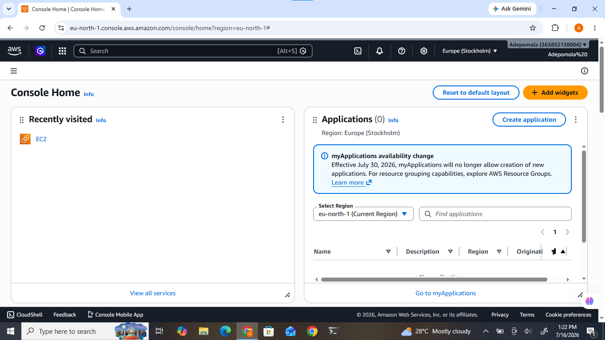

---

# Step 2: Open the EC2 Dashboard

After signing into AWS, the Elastic Compute Cloud (EC2) Dashboard was opened.

Amazon EC2 provides scalable virtual machines that can be configured with different operating systems and hardware specifications depending on application requirements.

The EC2 Dashboard serves as the central location for creating, monitoring, and managing virtual servers.

## DevOps Use Case

EC2 enables DevOps engineers to rapidly provision cloud infrastructure without purchasing or maintaining physical hardware.

### Screenshot

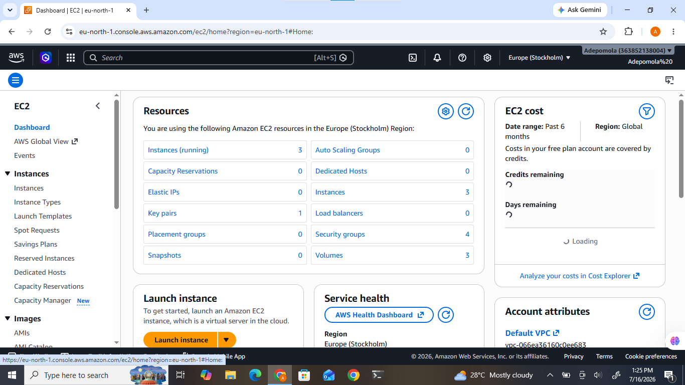

---

# Step 3: Launch a New EC2 Instance

A new EC2 instance was created using the Ubuntu 24.04 LTS Amazon Machine Image (AMI).

The instance type selected was *t2.micro*, which is eligible under the AWS Free Tier and suitable for lightweight development environments.

During instance creation, storage, networking, and security settings were configured.

## DevOps Use Case

Launching EC2 instances enables organizations to deploy applications quickly while benefiting from scalable cloud infrastructure.

### Screenshot

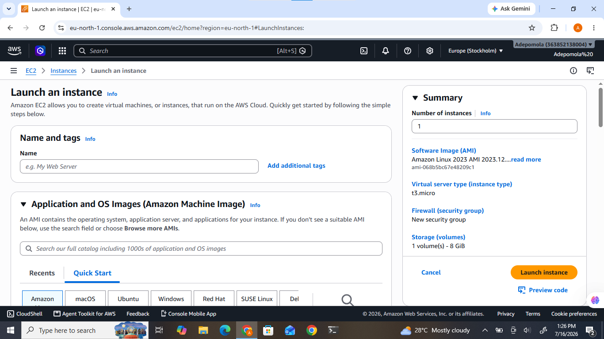

---

# Step 4: Create a Key Pair

A new EC2 Key Pair was generated before launching the instance.

The private key (.pem) file provides secure authentication when connecting to the server using SSH.

The private key was downloaded and stored securely because AWS does not allow it to be downloaded again after creation.

## DevOps Use Case

SSH Key Pairs provide secure password-less authentication, improving server security while simplifying remote administration.

### Screenshot

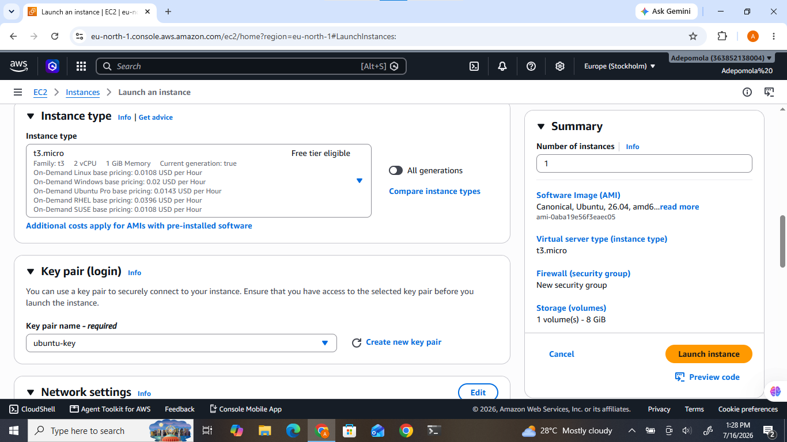

---

# Step 5: Launch the EC2 Instance

After configuring the required settings, the EC2 instance was successfully launched.

AWS allocated computing resources, attached storage, and initialized the Ubuntu operating system.

The instance entered the *Running* state after completing the initialization process.

## DevOps Use Case

Provisioning cloud servers enables rapid deployment of applications while allowing infrastructure to scale based on demand.

### Screenshot

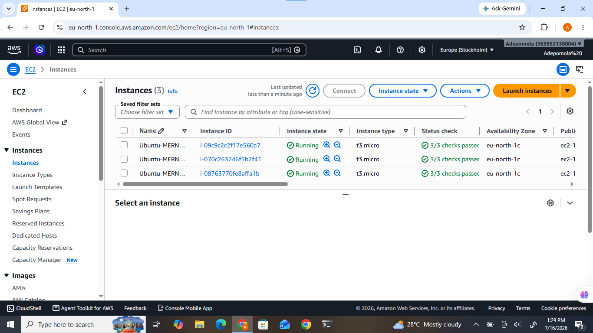

---

# Step 6: Verify the EC2 Instance is Running

The EC2 Dashboard was used to verify that the instance status changed to *Running* and all system status checks passed successfully.

This confirmed that the virtual machine was healthy and ready for deployment activities.

## DevOps Use Case

Monitoring instance health ensures infrastructure availability before software installation begins.

### Screenshot

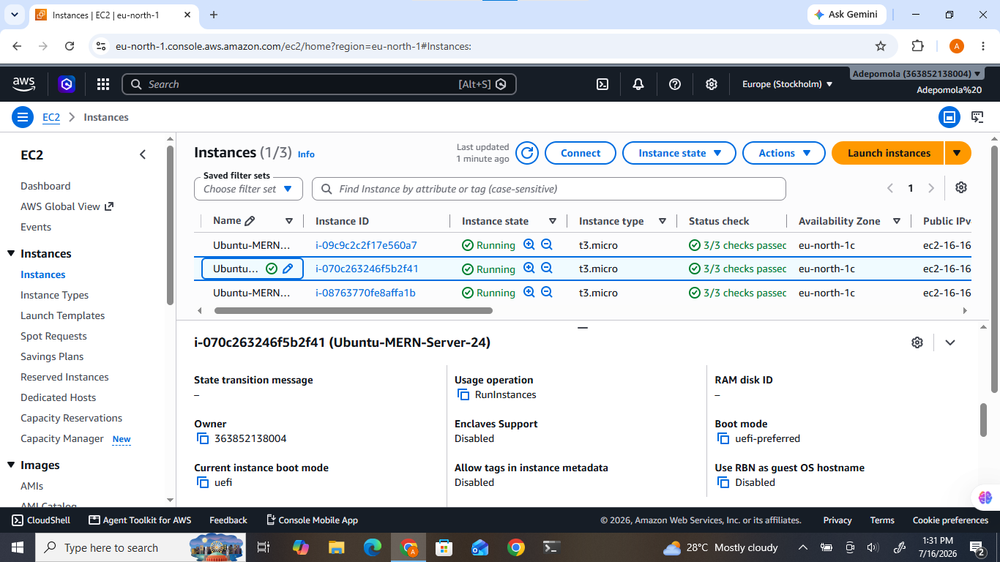

---

# Step 7: Connect to the EC2 Instance

The EC2 Instance Connect feature was used to establish a secure browser-based SSH session with the Ubuntu server.

This eliminated the need for additional SSH client software while providing direct access to the Linux terminal.

## DevOps Use Case

Remote administration is a fundamental DevOps responsibility that enables engineers to configure and maintain cloud servers securely.

### Screenshot

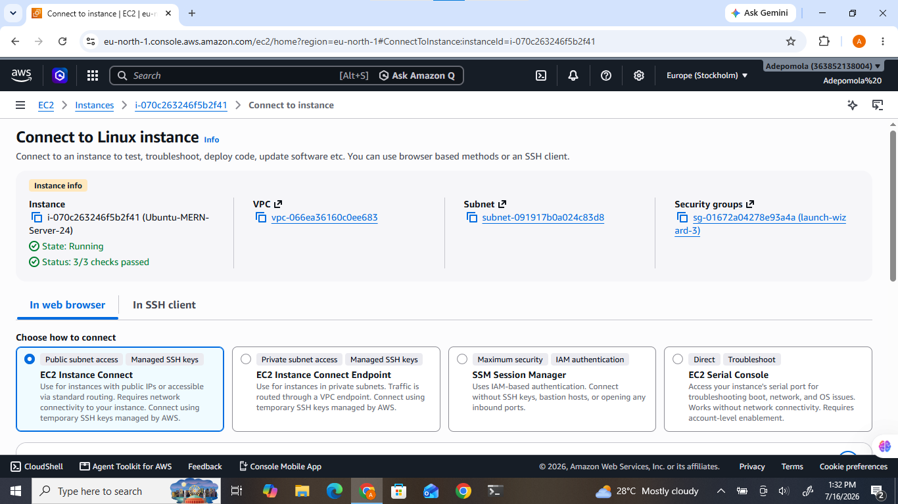

---
# Step 8: Access the Ubuntu Terminal

After connecting successfully to the EC2 instance, a browser-based Ubuntu terminal was opened using EC2 Instance Connect.

The terminal provided command-line access to the Linux server, allowing software installation, system configuration, and application deployment.

Linux commands were executed directly from this terminal throughout the project.

## DevOps Use Case

Linux command-line proficiency is an essential skill for DevOps engineers because most production servers are administered remotely through terminal sessions.

### Screenshot

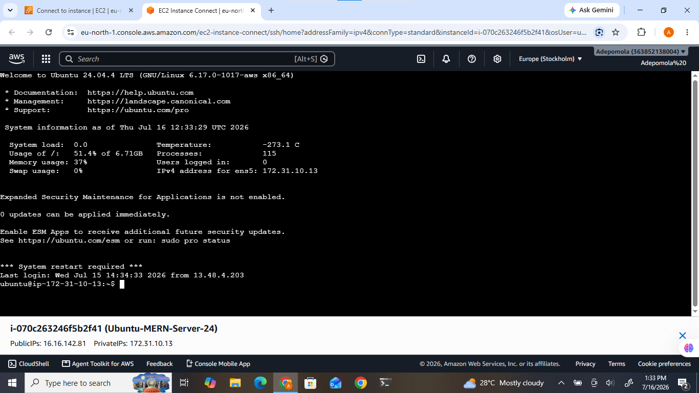

---

# Step 9: Verify the Ubuntu Operating System

The first task after logging into the server was to verify the operating system version.

## Command

```bash
lsb_release -a
```


## Explanation

The `lsb_release -a` command displays detailed information about the installed Linux distribution, including:

- Distributor ID
- Description
- Release Version
- Codename

This verification ensures that software packages installed later are compatible with the operating system.

## DevOps Use Case

Verifying the operating system version helps DevOps engineers install the correct software repositories and troubleshoot compatibility issues.

### Screenshot

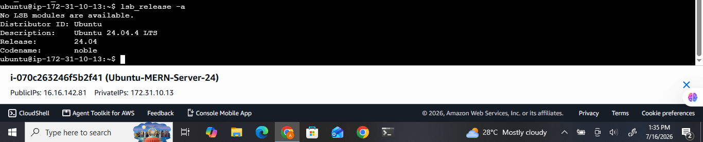

---

# Step 10: Update the Package Repository

Before installing any software, the package repository was updated.

## Command

```bash
sudo apt update
```


## Explanation

The `apt update` command refreshes the package index by downloading the latest package information from Ubuntu repositories.

Updating the package list ensures that the newest versions of available software can be installed.

## DevOps Use Case

Keeping package repositories up to date is considered a best practice for maintaining secure and stable Linux servers.

### Screenshot

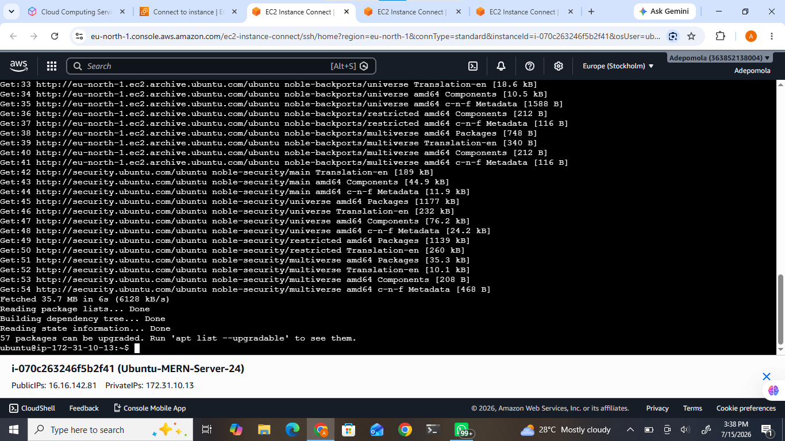

---

# Step 11: Upgrade Installed Packages

After updating the package repository, installed packages were upgraded.

## Command

```bash
sudo apt upgrade -y
```


## Explanation

The `apt upgrade` command installs the latest available versions of installed packages.

The `-y` option automatically accepts prompts during the upgrade process.

Performing upgrades ensures that security patches and software improvements are applied before deployment.

## DevOps Use Case

Regular software updates reduce security vulnerabilities and improve server reliability in production environments.

### Screenshot

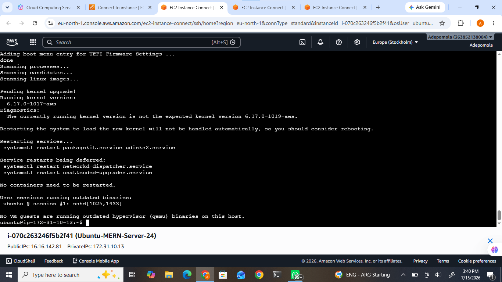

---

# Step 12: Install Git

Git was installed to manage source code and application files.

## Command

```bash
sudo apt install git -y
```


## Explanation

Git is a distributed version control system used to track changes in source code.

It enables developers to clone repositories, manage versions, collaborate with teams, and maintain deployment history.

## DevOps Use Case

Git is the industry standard for version control and forms the foundation of CI/CD pipelines and collaborative software development.

### Screenshot

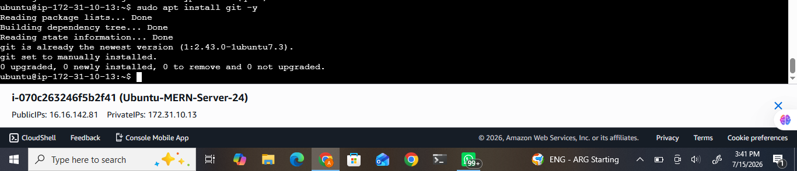

---

# Step 13: Verify Git Installation

After installation, the Git version was verified.

## Command

```bash
git --version
```


## Explanation

This command confirms that Git has been installed successfully by displaying the installed version.

Verifying installations helps ensure that required tools are ready before continuing with deployment.

## DevOps Use Case

Verification steps help prevent deployment failures caused by incomplete or incorrect software installations.

### Screenshot

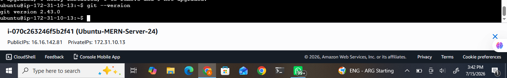

---

# Step 14: Install cURL

The cURL utility was installed to enable communication with web servers and APIs.

## Command

```bash
sudo apt install curl -y
```


## Explanation

cURL is a command-line tool used to transfer data using protocols such as HTTP and HTTPS.

During this project, cURL was later used to test whether the backend server was responding correctly.

## DevOps Use Case

DevOps engineers frequently use cURL to test APIs, verify server responses, troubleshoot connectivity issues, and automate deployment validation.

### Screenshot

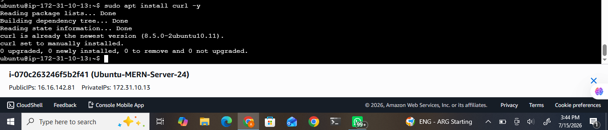

---
# Step 15: Configure the NodeSource Repository

Before installing Node.js, the official NodeSource repository was added to the Ubuntu server.

## Command

```bash
curl -fsSL https://deb.nodesource.com/setup_20.x | sudo -E bash -
```


## Explanation

The NodeSource setup script automatically configures the official Node.js package repository for Ubuntu. This ensures that the latest Long-Term Support (LTS) version of Node.js is installed instead of an outdated version from the default Ubuntu repository.

## DevOps Use Case

Using official software repositories ensures that applications receive stable releases, security updates, and long-term support in production environments.

### Screenshot

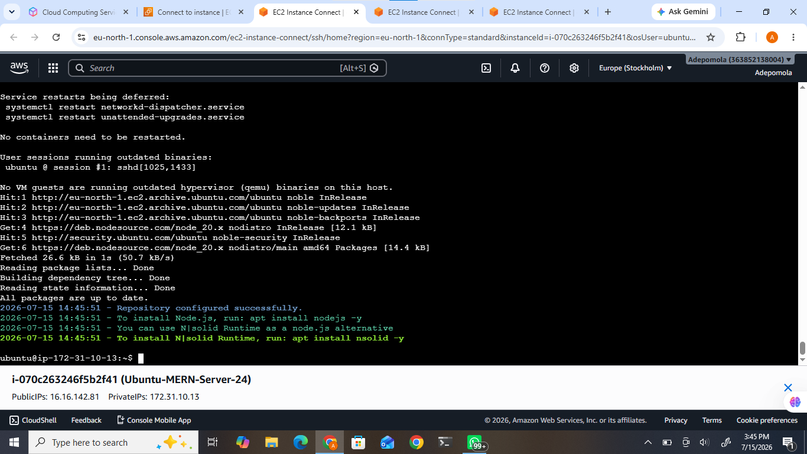

---

# Step 16: Install Node.js

After configuring the NodeSource repository, Node.js was installed.

## Command

```bash
sudo apt install nodejs -y
```


## Explanation

Node.js is a JavaScript runtime environment used to execute server-side JavaScript applications.

It provides the runtime required for Express.js and other backend components of the MERN stack.

## DevOps Use Case

Node.js is widely used for building scalable backend services, RESTful APIs, and real-time web applications.

### Screenshot


---

# Step 17: Verify Node.js and NPM Installation

After installation, both Node.js and Node Package Manager (NPM) were verified.

## Commands

```bash
node -v
```


```bash
npm -v
```


## Explanation

The `node -v` command displays the installed version of Node.js, while `npm -v` verifies the installation of Node Package Manager.

NPM is responsible for installing project dependencies and managing JavaScript packages.

## DevOps Use Case

Version verification confirms that the runtime environment is correctly installed before deploying applications.

### Screenshot

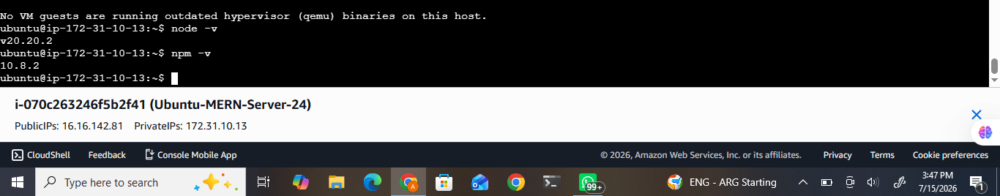

---

# Step 18: Import the MongoDB GPG Key

Before installing MongoDB, its official GPG key was imported.

## Command

```bash
curl -fsSL https://pgp.mongodb.com/server-8.0.asc | \
sudo gpg -o /usr/share/keyrings/mongodb-server-8.0.gpg \
--dearmor
```


## Explanation

The GPG key verifies the authenticity of MongoDB packages downloaded from the official repository.

This helps ensure that only trusted software is installed.

## DevOps Use Case

Importing repository signing keys is an important security practice that protects Linux servers from installing untrusted packages.

### Screenshot

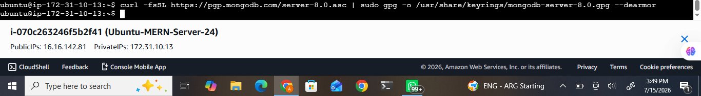

---

# Step 19: Configure the MongoDB Repository

After importing the GPG key, the MongoDB repository was added to Ubuntu.

## Command

```bash
echo "deb [ signed-by=/usr/share/keyrings/mongodb-server-8.0.gpg ] https://repo.mongodb.org/apt/ubuntu noble/mongodb-org/8.0 multiverse" | sudo tee /etc/apt/sources.list.d/mongodb-org-8.0.list
```


## Explanation

This command registers the official MongoDB software repository with Ubuntu's package manager.

It allows future updates and installations to come directly from MongoDB.

## DevOps Use Case

Official repositories provide trusted software packages and simplify application maintenance.

### Screenshot

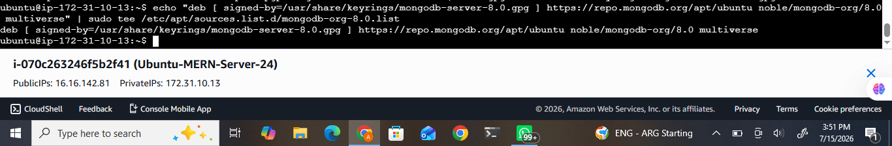

---

# Step 20: Update the Package Repository

After adding the MongoDB repository, the package index was updated.

## Command

```bash
sudo apt update
```

## Explanation

Updating the package index refreshes Ubuntu's package database to include software available from the newly added MongoDB repository.

## DevOps Use Case

Refreshing package indexes after adding repositories ensures that newly available software can be installed successfully.

### Screenshot

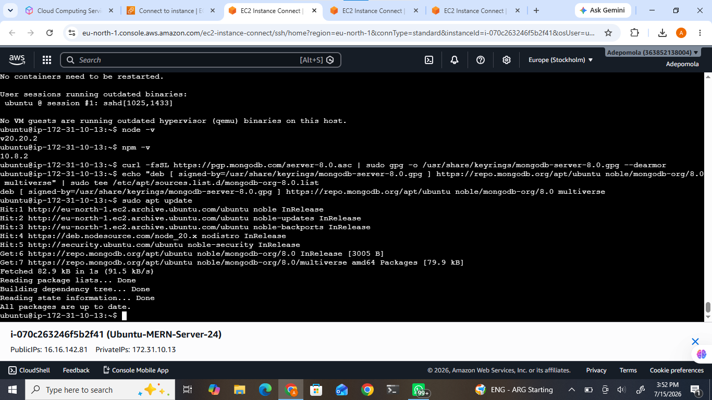

---

# Step 21: Install MongoDB

MongoDB Community Edition was installed on the Ubuntu server.

## Command

```bash
sudo apt install -y mongodb-org
```


## Explanation

MongoDB is a NoSQL document database that stores application data in flexible JSON-like documents.

Within the MERN stack, MongoDB serves as the database layer that stores and retrieves application information.

## DevOps Use Case

MongoDB is commonly used in cloud-native applications because of its scalability, high performance, and flexible document model.

### Screenshot

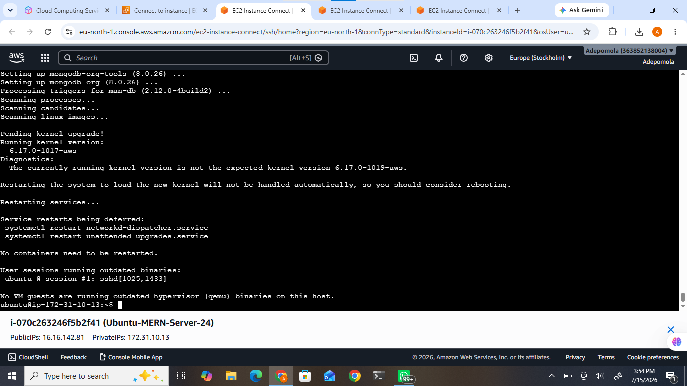

---
# Step 22: Review MongoDB Installation Errors

After installing MongoDB, an issue was encountered while attempting to start the database service. The system logs were reviewed to identify the cause of the problem.

## Command

```bash
sudo journalctl -u mongod
```


## Explanation

The `journalctl` command displays system logs generated by Linux services managed by `systemd`.

Reviewing the MongoDB logs helped identify startup failures and provided valuable information for troubleshooting the deployment.

Instead of assuming the problem, the logs were analyzed to determine the exact cause before implementing a solution.

## DevOps Use Case

Troubleshooting server logs is one of the most important responsibilities of a DevOps engineer. Log analysis helps identify application failures, configuration errors, and service startup problems quickly.

### Screenshot

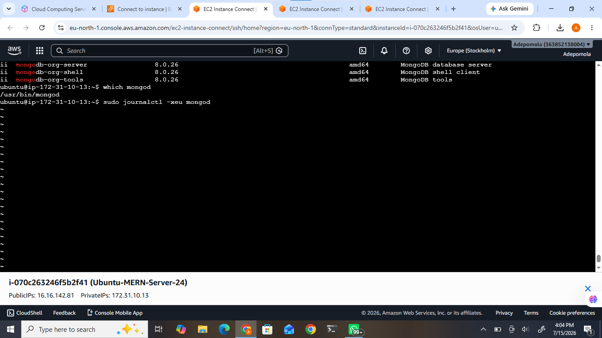

---

# Step 23: Verify the MongoDB Service Status

After resolving the installation issue, the MongoDB service status was verified.

## Command

```bash
sudo systemctl status mongod
```


## Explanation

The `systemctl status` command displays the current state of the MongoDB service.

The output confirmed that MongoDB was successfully running and ready to accept database connections.

This verification step ensured that the database layer of the MERN application was operational before proceeding with the backend deployment.

## DevOps Use Case

Verifying service status ensures that applications depending on background services can communicate successfully without runtime failures.

### Screenshot

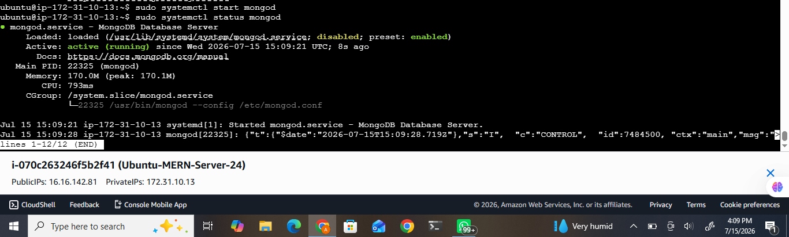

---

# Step 24: Install Nginx

Nginx was installed on the Ubuntu server to provide web server functionality.

## Command

```bash
sudo apt install nginx -y
```


## Explanation

Nginx is a lightweight, high-performance web server widely used to serve static content, reverse proxy backend applications, and improve application scalability.

Although the React development server was used during testing, installing Nginx provides the foundation for deploying production-ready web applications.

## DevOps Use Case

Nginx is commonly used in production environments to improve application performance, load balancing, SSL termination, and reverse proxy configuration.

### Screenshot

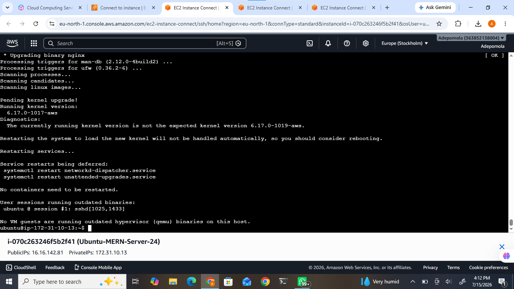

---

# Step 25: Start the Nginx Service

After installation, the Nginx service was started.

## Command

```bash
sudo systemctl start nginx
```


## Explanation

The `systemctl start` command launches the Nginx service immediately without requiring a server reboot.

Starting the service allows Nginx to begin listening for incoming HTTP requests.

## DevOps Use Case

Managing Linux services using `systemctl` is an essential skill for DevOps engineers responsible for maintaining production infrastructure.

### Screenshot

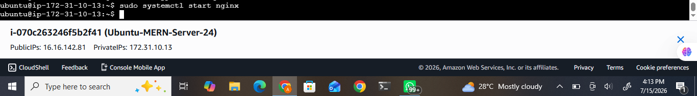

---

# Step 26: Enable Nginx to Start Automatically

The Nginx service was configured to start automatically whenever the server boots.

## Command

```bash
sudo systemctl enable nginx
```


## Explanation

Enabling the service creates the necessary startup links so that Nginx launches automatically after every system restart.

This eliminates the need to manually start the service after rebooting the EC2 instance.

## DevOps Use Case

Automatically starting essential services improves server reliability and reduces manual intervention after maintenance or unexpected restarts.

### Screenshot

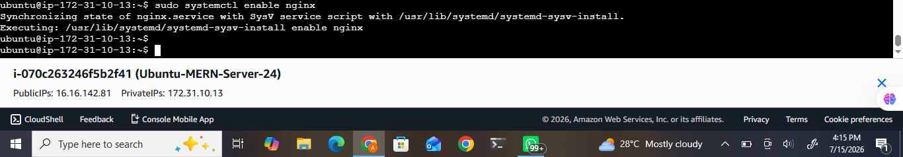

---

# Step 27: Verify the Nginx Service

The final step of the Nginx installation process was verifying that the service was running correctly.

## Command

```bash
sudo systemctl status nginx
```


## Explanation

This command displays detailed information about the Nginx service, including whether it is active, inactive, or has encountered any startup issues.

Successful verification confirmed that the web server had been installed correctly.

## DevOps Use Case

Service verification helps prevent deployment failures by ensuring that critical infrastructure components are functioning correctly before application deployment.

### Screenshot

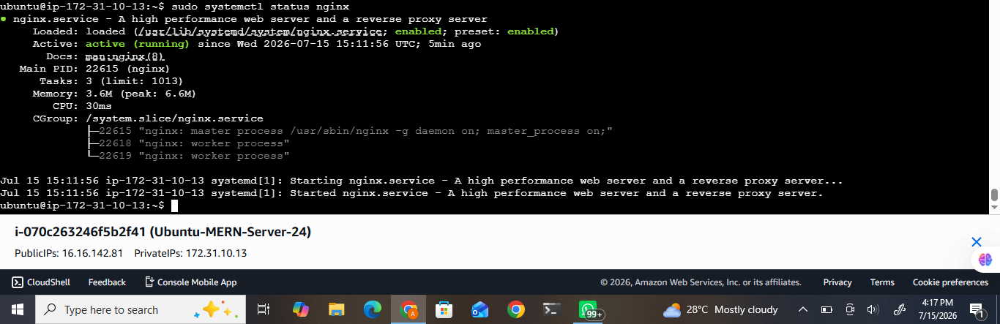

---
# Step 28: Create the MERN Project Directory

A dedicated project directory was created to organize both the backend and frontend components of the MERN application.

## Command

```bash
mkdir MERN-Application
cd MERN-Application
```


## Explanation

The `mkdir` command creates a new directory, while the `cd` command changes the current working directory.

Creating a dedicated project folder improves organization by keeping all project files in one location.

## DevOps Use Case

Organizing project files into a structured directory hierarchy improves maintainability and simplifies deployment, troubleshooting, and version control.

### Screenshot

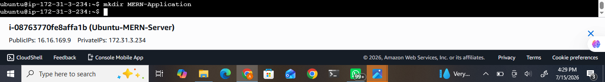

---

# Step 29: Create the Backend Directory

A separate directory was created for the backend application.

## Command

```bash
mkdir backend
cd backend
```


## Explanation

The backend directory contains the Express.js application, configuration files, package dependencies, and server-side logic.

Separating the backend from the frontend follows the standard MERN project structure and improves code organization.

## DevOps Use Case

Maintaining separate frontend and backend directories enables independent development, deployment, and maintenance of each application component.

### Screenshot

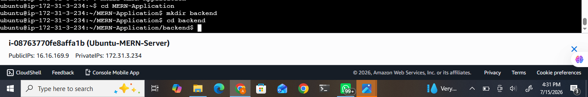

---

# Step 30: Initialize the Backend Project and Install Dependencies

The backend project was initialized, and the required Node.js packages were installed.

## Commands

Initialize the project:

```bash
npm init -y
```


Install the required dependencies:

```bash
npm install express mongoose cors dotenv
```


## Explanation

The `npm init -y` command automatically creates a `package.json` file containing the project's metadata.

The required packages were then installed:

- *Express.js* – Web framework for building REST APIs.
- *Mongoose* – MongoDB Object Data Modeling (ODM) library.
- *CORS* – Enables secure communication between the frontend and backend.
- *dotenv* – Loads environment variables from a .env file.

These packages form the foundation of the backend application.

## DevOps Use Case

Managing application dependencies using NPM ensures consistent deployments across development, testing, and production environments.

### Screenshot


---

# Step 31: Verify Backend Dependency Installation

After installation, the backend dependencies were verified to ensure that all required packages were successfully installed.

## Command

```bash
ls
```

or

```bash
npm list
```


## Explanation

Successful installation creates:

- `node_modules`
- `package.json`
- `package-lock.json`

These files confirm that the backend environment has been prepared successfully.

## DevOps Use Case

Verifying installed dependencies reduces deployment failures caused by missing libraries or incomplete installations.

### Screenshot

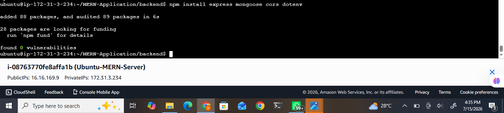

---

# Step 32: Create the Backend Server

The Express backend application was created by writing the server.js file.

## File

```text
server.js
```


## Explanation

The server performs the following tasks:

- Imports required modules.
- Connects to MongoDB.
- Enables CORS.
- Parses JSON requests.
- Defines the application's API endpoint.
- Starts the Express server on port *5000*.

This file serves as the entry point for the backend application.

## DevOps Use Case

Application configuration files define how services communicate and provide the foundation for scalable backend deployments.

### Screenshot

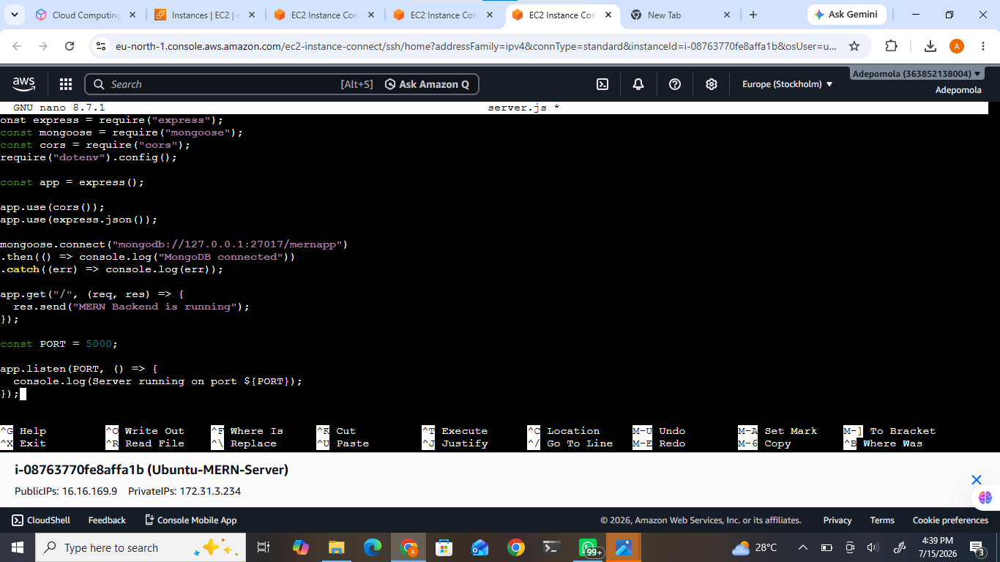

---

# Step 33: Start the Backend Server

After creating the server file, the backend application was started.

## Command

```bash
node server.js
```


## Explanation

Executing the `node server.js` command starts the Express application.

Successful startup displays messages confirming that:

- MongoDB connected successfully.
- The backend server is listening on port *5000*.

This verified that the backend application was functioning correctly.

## DevOps Use Case

Starting backend services allows developers to validate application functionality before deployment into production environments.

### Screenshot

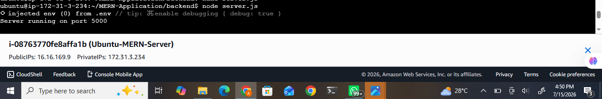

---

# Step 34: Test Backend Connectivity

The backend server was tested using the `curl` command.

## Command

```bash
curl http://localhost:5000
```


## Explanation

The `curl` command sends an HTTP request directly to the Express server.

Receiving the response:

```text
MERN Backend is running
```


confirmed that the backend application was responding successfully.

Testing backend endpoints before connecting the frontend helps isolate issues during deployment.

## DevOps Use Case

API testing using command-line tools enables DevOps engineers to verify service availability and troubleshoot connectivity problems.


---

# Step 35: Verify Backend Port 5000

The Linux `ss` command was used to verify that the backend server was actively listening on port *5000*.

## Command

```bash
sudo ss -tlnp | grep 5000
```


## Explanation

The `ss` command displays active network sockets and listening ports.

The output confirmed that the Node.js application was successfully bound to port *5000*, making it ready to receive HTTP requests.

Verifying open ports is an important troubleshooting step during application deployment.

## DevOps Use Case

Monitoring network ports helps identify configuration issues and confirms that deployed services are accessible to clients.

### Screenshot

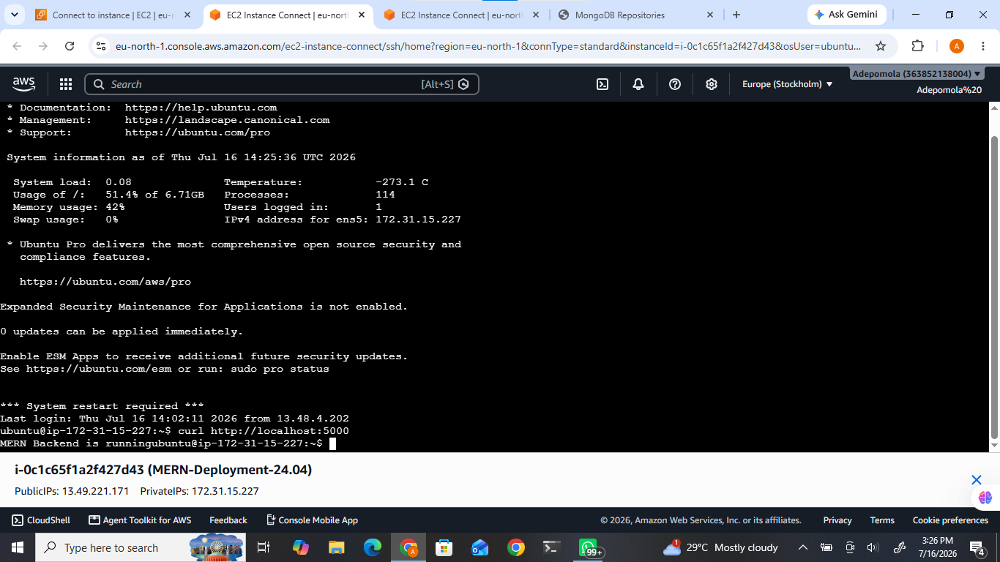

---
# Step 36: Create the React Frontend Application

After successfully configuring the backend, the frontend application was created using Create React App.

## Command

```bash
npx create-react-app frontend
```


## Explanation

The `create-react-app` utility automatically generates the project structure required for a React application.

The generated project includes:

- React components
- Development server
- Package configuration
- Build scripts
- Static assets

This provides a ready-to-use frontend environment for developing the user interface.

## DevOps Use Case

Automating project scaffolding improves development efficiency and ensures consistent application structure across projects.

### Screenshot

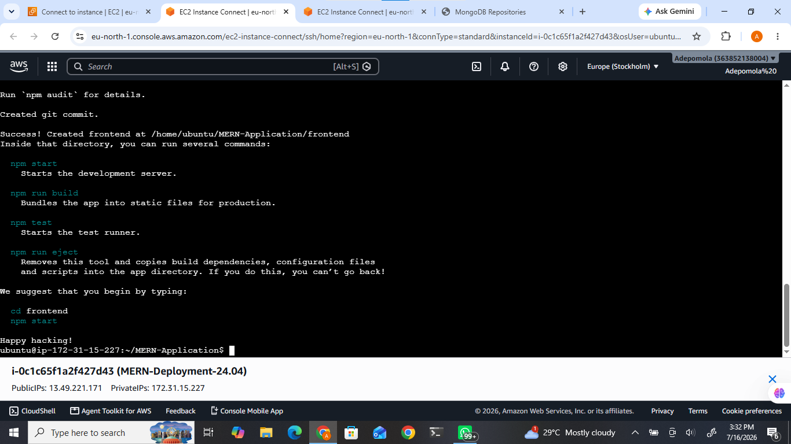

---

# Step 37: Start the React Development Server

After creating the React application, the development server was started.

## Commands

```bash
cd ~/MERN-Application/frontend
```


```bash
npm start
```


## Explanation

The `npm start` command launches the React development server on *Port 3000*.

The application is automatically compiled and monitored for file changes, allowing updates to appear immediately during development.

## DevOps Use Case

Development servers provide rapid feedback during software development and simplify application testing before deployment.

### Screenshot

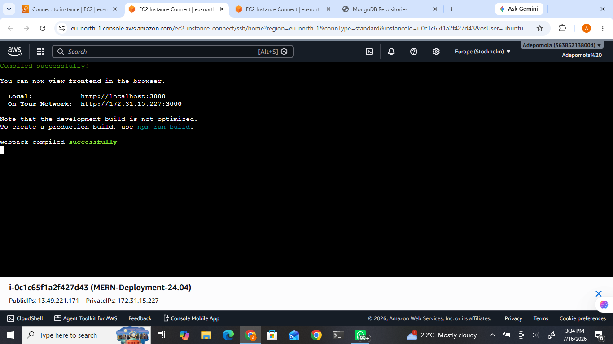

---

# Step 38: Verify the React Application

The React application was accessed through the web browser to confirm that the frontend was running successfully.

Initially, the default React application page was displayed, confirming that the development server was operating correctly.

## Explanation

Accessing the frontend verifies that:

- React compiled successfully.
- The development server is running.
- Port *3000* is accessible.
- The application is ready for customization.

## DevOps Use Case

Verifying frontend deployment ensures users can successfully access the web application before backend integration.

### Screenshot

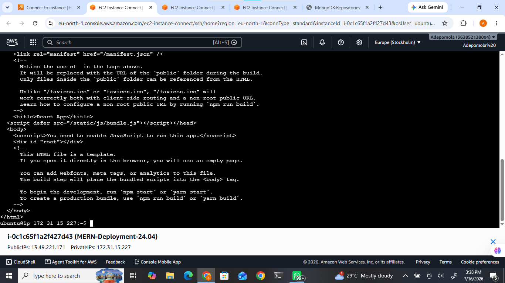

---

# Step 39: Update the React Application

The default React application was modified to communicate with the Express backend.

## File

```text
App.js
```


## Code Modification

The application was updated to send an HTTP request to the backend server using the EC2 public IP address.

```javascript
fetch("http://13.49.221.171:5000/")
```


## Explanation

The React application uses the Fetch API to retrieve data from the Express backend.

Initially, the frontend attempted to communicate with `localhost`, which resulted in a connection failure because the frontend and backend communicate over the EC2 public IP.

Updating the API endpoint resolved the communication issue.

## DevOps Use Case

Frontend and backend integration is essential in modern web application deployment. Correct API endpoint configuration ensures successful communication between distributed application components.

### Screenshot

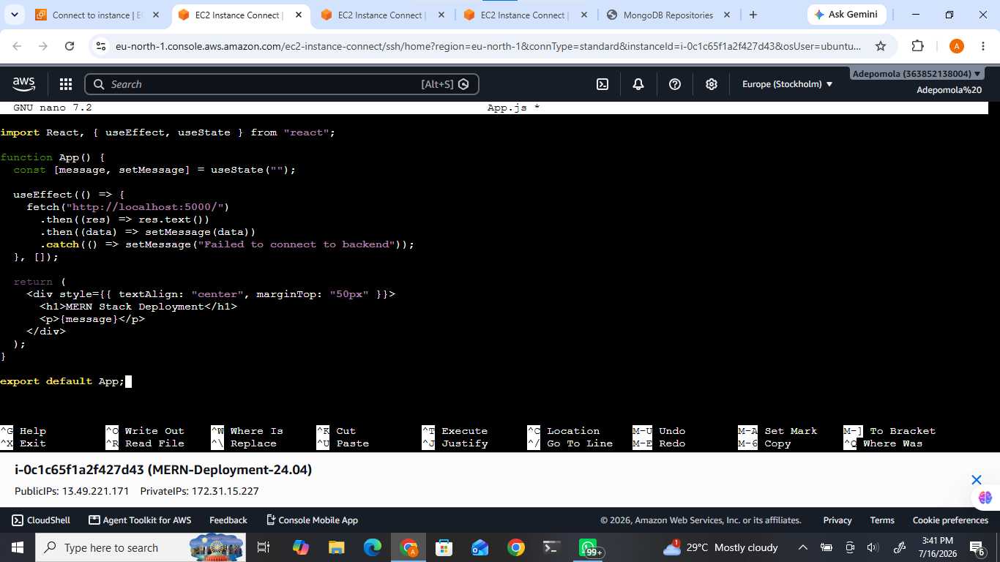

---

# Step 40: Restart the React Development Server

After updating the frontend source code, the React development server was restarted.

## Commands

Stop the running server:

```text
Ctrl + C
```


Restart the application:

```bash
HOST=0.0.0.0 npm start
```


## Explanation

Restarting the development server applies configuration changes made to the application.

The `HOST=0.0.0.0` option allows the React application to accept external connections through the EC2 public IP address.

## DevOps Use Case

Restarting services after configuration changes is a standard deployment practice that ensures updated settings are applied correctly.

### Screenshot

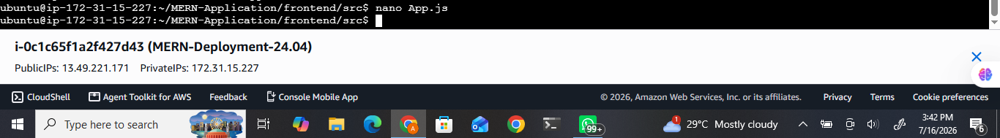

---

# Step 41: Verify Nginx Installation

The Nginx installation was verified to ensure the web server was correctly installed on the EC2 instance.

## Command

```bash
nginx -v
```


## Explanation

This command displays the installed version of Nginx, confirming that the installation completed successfully.

Verifying installed software helps prevent configuration issues during deployment.

## DevOps Use Case

Verification ensures required infrastructure components are available before production deployment.

### Screenshot

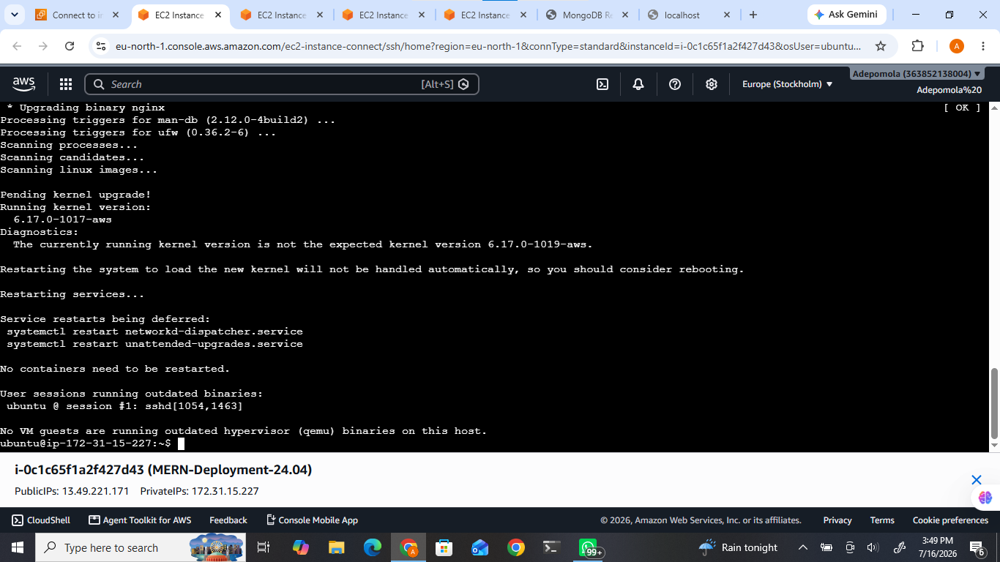

---

# Step 42: Verify Running Services

The running services required for the MERN application were verified.

## Commands

```bash
node server.js
```


```bash
npm start
```


## Explanation

At this stage, both application components were confirmed to be running simultaneously.

- Express Backend running on Port *5000*
- React Frontend running on Port *3000*

Successful execution confirmed that both services were operational.

## DevOps Use Case

Monitoring running services ensures that multi-tier applications remain available throughout deployment.

### Screenshot

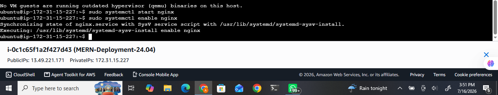

---

# Step 43: Verify the Nginx Service Status

The Nginx service status was checked one final time.

## Command

```bash
sudo systemctl status nginx
```


## Explanation

Verifying service status confirmed that the Nginx web server remained active after completing the deployment process.

## DevOps Use Case

Routine service verification helps maintain infrastructure reliability and minimizes unexpected downtime.

### Screenshot

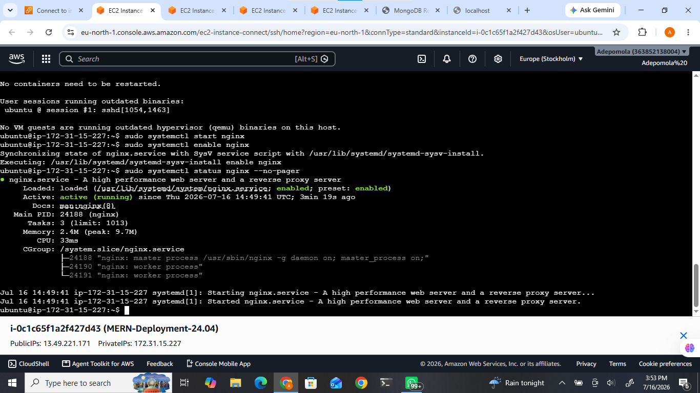

---

# Step 44: Configure AWS Security Group Rules

Inbound security group rules were updated to allow access to the deployed application.

## Ports Configured

| Port | Purpose |
|-------|----------|
| 22 | SSH Remote Access |
| 3000 | React Frontend |
| 5000 | Express Backend |
| 80 | HTTP (Nginx) |

## Explanation

AWS Security Groups function as virtual firewalls that control inbound and outbound traffic.

Opening the required ports allowed users to access both the frontend and backend services from a web browser.

## DevOps Use Case

Proper firewall configuration is a critical aspect of cloud security and application availability.

### Screenshot

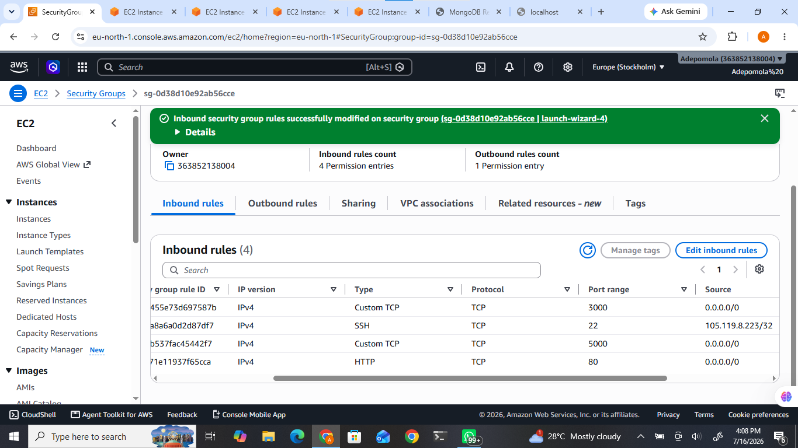

---


# Step 45: Verify the EC2 Public IP Address

The public IPv4 address assigned to the EC2 instance was verified before testing the deployed application.

## Explanation

The public IP address enables external users to access applications hosted on the EC2 instance.

This address was also used to configure frontend communication with the backend.

Application URLs:

Frontend

```

http://13.49.221.171:3000
```


Backend

```

http://13.49.221.171:5000
```


## DevOps Use Case

Public IP verification ensures cloud-hosted applications remain accessible after deployment.

### Screenshot

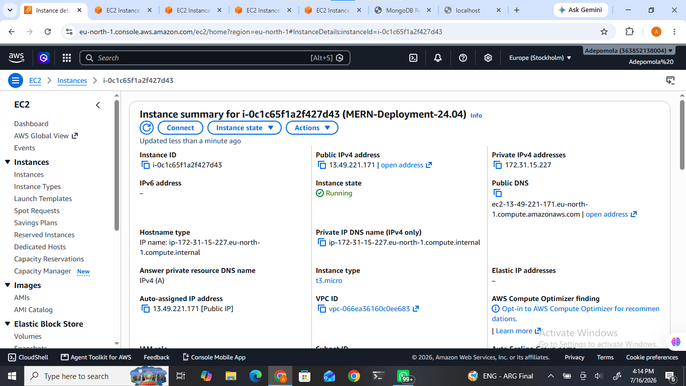

---

# Step 46: Successfully Deploy and Test the MERN Application

The deployment process concluded by successfully testing both the frontend and backend applications.

The backend responded successfully through the browser, while the React frontend displayed the backend response, confirming successful communication between all components of the MERN stack.

## Testing Performed

Backend

```text
http://13.49.221.171:5000
```


Frontend

```text
http://13.49.221.171:3000
```


Both URLs were successfully accessed, confirming that the deployment was complete.

## DevOps Use Case

End-to-end application testing validates that every layer of the deployed application is functioning correctly before production release.

### Screenshot

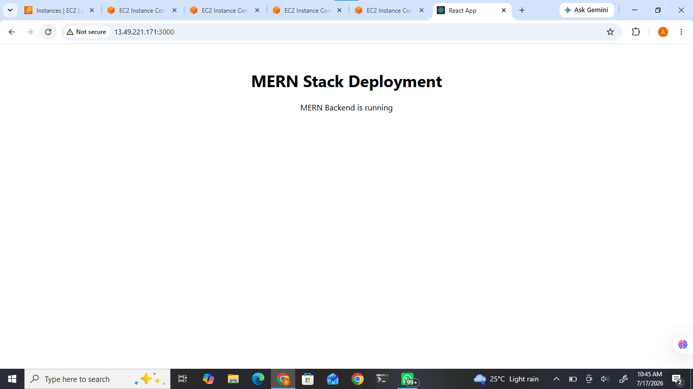

---
# Challenges Encountered

Several challenges were encountered during the deployment process. Each challenge required careful troubleshooting and testing before a successful solution was implemented.

## Challenge 1: MongoDB Service Failed to Start

After installing MongoDB, the database service failed to start successfully. This prevented the backend application from connecting to the database.

### Solution

The MongoDB service status and system logs were examined using the following commands:

```bash
sudo systemctl status mongod
```


```bash
sudo journalctl -u mongod
```


The logs were analyzed to determine the cause of the failure. After correcting the configuration and restarting the service, MongoDB started successfully.

---

## Challenge 2: Backend Failed to Connect to MongoDB

Initially, the Express server could not establish a connection with the MongoDB database.

### Solution

The MongoDB connection string was reviewed, and the database service was verified to be running before restarting the backend application.

Successful connection was confirmed by the message:

```text
MongoDB connected
```


---

## Challenge 3: React Frontend Failed to Connect to the Backend

One of the most significant challenges encountered during the deployment process was the inability of the React frontend to communicate with the Express backend.

Initially, the application displayed the following message:

```text
Failed to connect to backend
```


### Solution

After troubleshooting the application, the following issues were resolved:

- The Express server was configured to listen on all available network interfaces.

```javascript
app.listen(PORT, "0.0.0.0", () => {
    console.log(`Server running on port ${PORT}`);
});
```

- The React application was updated to communicate with the EC2 public IP instead of `localhost`.

```javascript
fetch("http://13.49.221.171:5000/")
```


- The React development server was restarted.

These changes successfully established communication between the frontend and backend.

---

## Challenge 4: AWS Security Group Configuration

The deployed application was initially inaccessible from the web browser because the required inbound ports were not properly configured.

### Solution

The Security Group inbound rules were updated to allow traffic on the required ports.

| Port | Purpose |
|-------|----------|
| 22 | SSH |
| 3000 | React Frontend |
| 5000 | Express Backend |
| 80 | HTTP |

After updating the firewall rules, the application became accessible through the EC2 public IP address.

---

## Challenge 5: Testing Application Connectivity

Verifying communication between the frontend and backend required additional troubleshooting using Linux networking tools.

### Solution

The following commands were used during testing:

```bash
curl http://localhost:5000
```


```bash
sudo ss -tlnp | grep 5000
```


These commands confirmed that the backend server was listening on Port *5000* and responding correctly to HTTP requests.

---

# Project Outcome

The deployment was successfully completed.

The following components were successfully configured and tested:

- Amazon EC2 Instance
- Ubuntu Linux Server
- Git
- Node.js
- NPM
- MongoDB
- Express.js
- React.js
- AWS Security Groups
- Backend API
- Frontend Application

The frontend and backend communicated successfully through the EC2 public IP address, confirming a successful MERN Stack deployment.

---

# Skills Demonstrated

Throughout this project, the following technical skills were developed and applied:

- Amazon Web Services (AWS)
- Amazon EC2
- Linux System Administration
- Ubuntu Server Management
- Shell Commands
- Git Version Control
- Node.js Installation and Configuration
- NPM Package Management
- MongoDB Installation and Administration
- Express.js Backend Development
- React.js Frontend Development
- MERN Stack Deployment
- AWS Security Group Configuration
- Linux Service Management
- Network Port Verification
- API Testing using cURL
- Application Troubleshooting
- Cloud Infrastructure Deployment
- Technical Documentation

---

# Conclusion

This project provided practical experience in deploying a full-stack MERN application on an Amazon EC2 instance.

The deployment process involved provisioning cloud infrastructure, configuring the Ubuntu operating system, installing the required software packages, deploying the backend and frontend applications, configuring AWS networking, and troubleshooting deployment issues.

Although several challenges were encountered during the project, systematic troubleshooting and testing led to successful deployment of the application.

This project strengthened practical knowledge of cloud computing, Linux system administration, web application deployment, networking, and DevOps best practices. The experience gained provides a solid foundation for deploying scalable web applications in cloud environments.

---

# References

1. Amazon Web Services. Amazon EC2 Documentation.

https://docs.aws.amazon.com/ec2/

2. MongoDB Documentation.

https://www.mongodb.com/docs/

3. Node.js Documentation.

https://nodejs.org/docs

4. Express.js Documentation.

https://expressjs.com/

5. React Documentation.

https://react.dev/

6. Ubuntu Server Guide.

https://ubuntu.com/server/docs

7. Nginx Documentation.

https://nginx.org/en/docs/

---

# Author

*Name:* Adepomola Ayomide

*Course:* DevOps Engineering

*Project:* Critical Thinking Project – Deploying a MERN Stack on an EC2 Instance

*Cloud Platform:* Amazon Web Services (AWS)

*Technology Stack:* MongoDB • Express.js • React.js • Node.js
